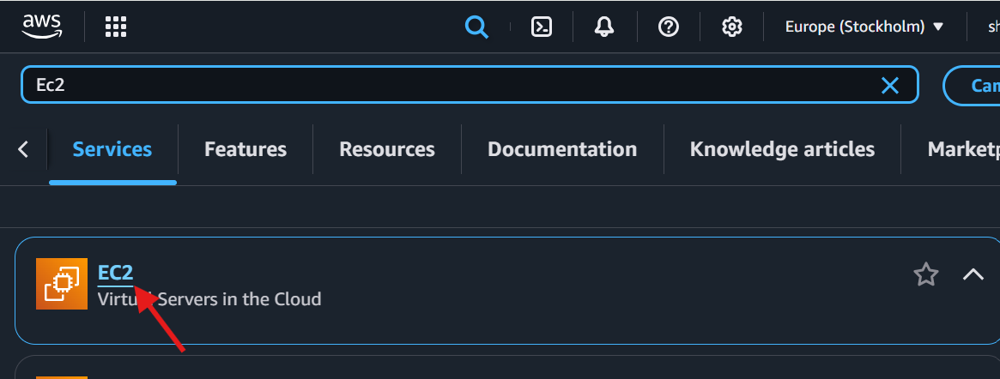
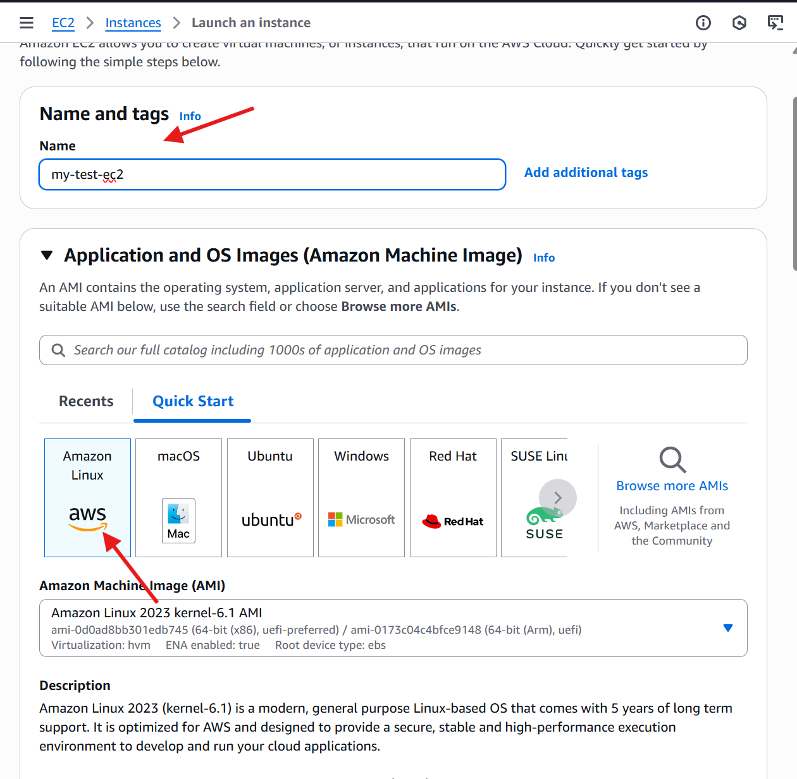
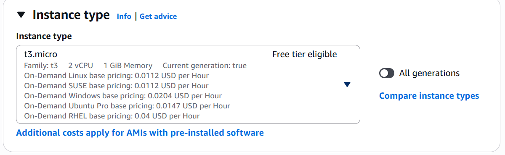
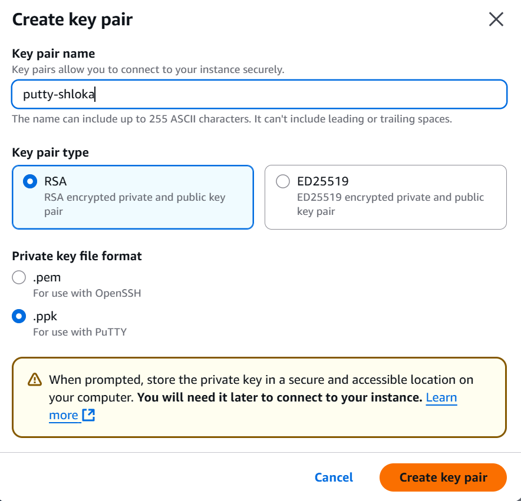
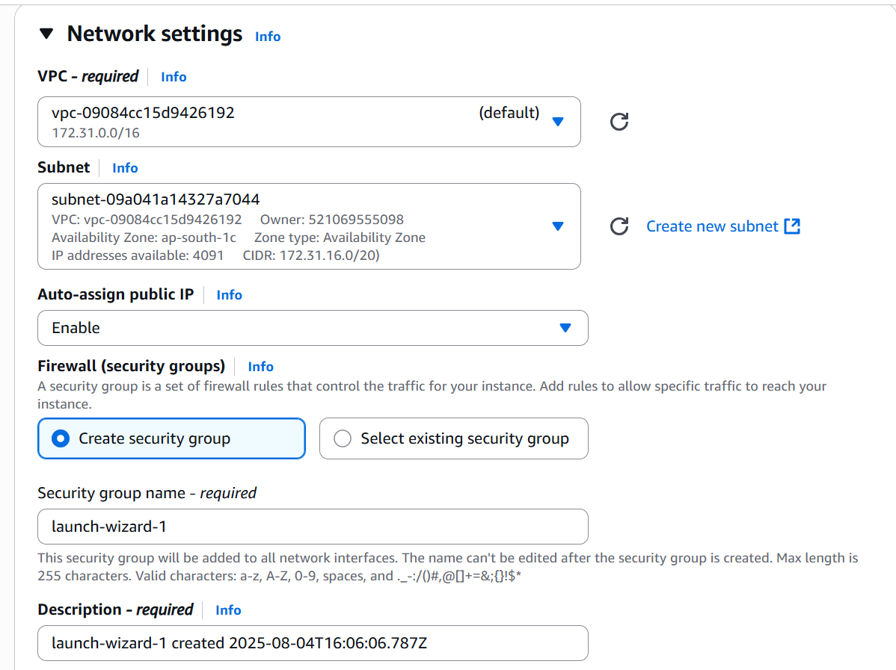
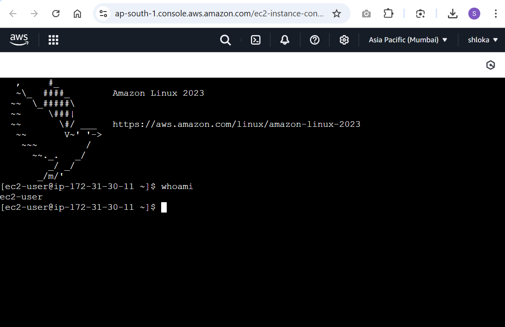

# EC2 Compute Using AWS Console

## Objective

Learn to **launch and configure an Amazon EC2 instance** manually using the AWS Management Console. This hands-on guide covers all fundamental EC2 components with visual step-by-step instructions.

> **Note**: Manual provisioning is great for learning but not recommended for production. See [Terraform Guide](../terraform/COMPUTE_TERRAFORM.md) for automated deployments.

---

## Prerequisites

Before you begin, ensure you have:

- [ ] An **AWS account** (Free Tier eligible)
- [ ] An **IAM user** with EC2 permissions (or use root for learning)
- [ ] Basic understanding of Linux commands (for SSH)

---

## EC2 Instance Launch Procedure

### Step 1: Access EC2 Dashboard

1. Log in to the [AWS Management Console](https://console.aws.amazon.com/)
2. In the search bar, type **"EC2"**
3. Click on **EC2 - Virtual Servers in the Cloud**



*The search bar is the fastest way to navigate to any AWS service. You can also use the Services menu.*

---

### Step 2: Choose an AMI (Amazon Machine Image)

Click **"Launch Instance"** and you'll see the instance configuration page:



**What is an AMI?**
An AMI is a **pre-configured template** that contains:
- Operating System (Linux, Windows, etc.)
- Pre-installed software and tools
- Launch permissions and block device mapping

**Recommended Selection**:
| AMI | Description | Free Tier |
|-----|-------------|:---------:|
| Amazon Linux 2023 | AWS-optimized, secure, stable | Yes |
| Ubuntu 22.04 LTS | Popular for development | Yes |
| Windows Server 2022 | For .NET applications | Partial |

> **Tip**: Amazon Linux 2023 is optimized for AWS and receives long-term support.

---

### Step 3: Select Instance Type

The **instance type** determines the hardware specifications of your virtual server:



**Instance Type Components**:
| Component | Description |
|-----------|-------------|
| **vCPUs** | Virtual CPUs allocated to the instance |
| **Memory** | RAM available to the instance |
| **Storage** | Type and speed of default storage |
| **Network** | Network bandwidth capabilities |

**For Learning/Testing** (Free Tier Eligible):

| Instance Type | vCPUs | Memory | Use Case |
|---------------|:-----:|:------:|----------|
| `t2.micro` | 1 | 1 GB | Basic testing, learning |
| `t3.micro` | 2 | 1 GB | Light applications |

> **Important**: `t2.micro` is Free Tier eligible for 750 hours/month in the first 12 months.

---

### Step 4: Configure Key Pair

A **key pair** is essential for secure SSH access to your instance:



**Key Pair Configuration**:

| Field | Recommended Value | Description |
|-------|-------------------|-------------|
| Key pair name | `my-ec2-keypair` | Descriptive name for identification |
| Key pair type | **RSA** | More widely compatible |
| Private key format | **.pem** (Linux/Mac) / **.ppk** (Windows/PuTTY) | Choose based on your OS |

**Critical Steps**:
1. Click **"Create key pair"**
2. **Download and save** the `.pem` or `.ppk` file immediately
3. Store it in a secure location (you cannot download it again!)

> **Security**: Never share your private key file. Set file permissions to `chmod 400 key.pem` on Linux/Mac.

---

### Step 5: Configure Network Settings

Network settings control **how your instance connects** to the internet and other resources:



**Key Network Settings**:

| Setting | Recommended Value | Purpose |
|---------|-------------------|---------|
| **VPC** | Default VPC | Virtual Private Cloud for isolation |
| **Subnet** | Default subnet | Network subdivision in an AZ |
| **Auto-assign Public IP** | **Enable** | Required for internet/SSH access |
| **Security Group** | Create new or select existing | Firewall rules |

**Security Group Rules** (for SSH access):

| Type | Protocol | Port | Source | Description |
|------|----------|:----:|--------|-------------|
| SSH | TCP | 22 | My IP (`x.x.x.x/32`) | Secure SSH access |

> **Security Best Practice**: Never use `0.0.0.0/0` for SSH. Always restrict to your IP.

---

### Step 6: Launch Instance

1. Review all configuration settings
2. Click **"Launch Instance"**
3. Wait for the instance state to change to **"Running"**



The instance is now running! Note the **Public IPv4 address** for SSH connection.

---

## Connecting to Your Instance

### For Linux/Mac Users

Open Terminal and run:

```bash
# Set correct permissions for your key file
chmod 400 my-ec2-keypair.pem

# Connect via SSH
ssh -i my-ec2-keypair.pem ec2-user@<PUBLIC_IP>
```

### For Windows Users (PuTTY)

1. Open PuTTY
2. Enter your **Public IP** in the "Host Name" field
3. Navigate to **Connection → SSH → Auth → Credentials**
4. Browse to your `.ppk` key file
5. Click **Open**

### Successful Connection

When you see the Amazon Linux banner and command prompt:

```
       __|  __|_  )
       _|  (     /   Amazon Linux 2023
      ___|\___|___|

[ec2-user@ip-172-31-xx-xx ~]$ 
```

**Congratulations!** You've successfully launched and connected to your first EC2 instance!

---

## Limitations of Manual Provisioning

| Limitation | Impact |
|------------|--------|
| No version control | Cannot track changes or roll back |
| Difficult to reproduce | Each setup may have slight variations |
| Time-consuming | Not scalable for large environments |
| Prone to human error | Misconfigurations are common |
| No collaboration | Difficult for teams to work together |

---

## Conclusion

Manual EC2 provisioning via the AWS Console is:

**Great for**: Learning, experimentation, quick one-off tasks

**Not suitable for**: Production environments, team collaboration, repeatable deployments

---

## Next Steps

Ready to automate? Continue with:

1. **[Terraform Introduction](../terraform/TERRAFORM_INTRO.md)** – Learn Infrastructure as Code basics
2. **[EC2 with Terraform](../terraform/COMPUTE_TERRAFORM.md)** – Automate EC2 provisioning

---

## Cleanup (Important!)

To avoid charges, remember to **terminate your instance** when done:

1. Go to **EC2 → Instances**
2. Select your instance
3. Click **Instance state → Terminate instance**

> Free Tier includes 750 hours/month. Monitor your usage to avoid unexpected charges.
